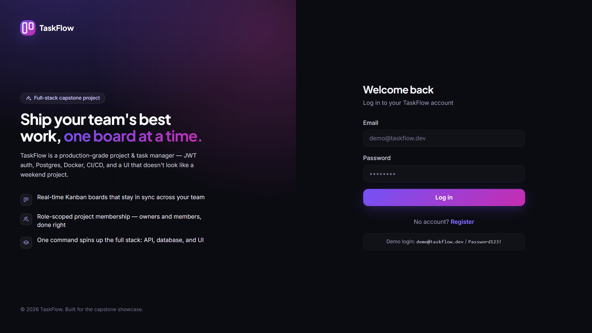
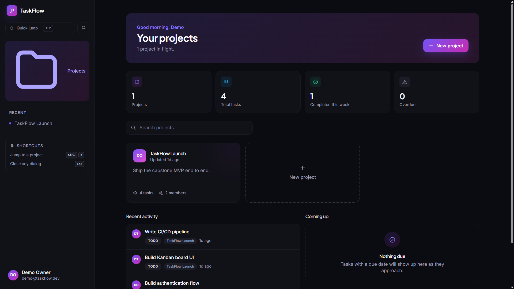
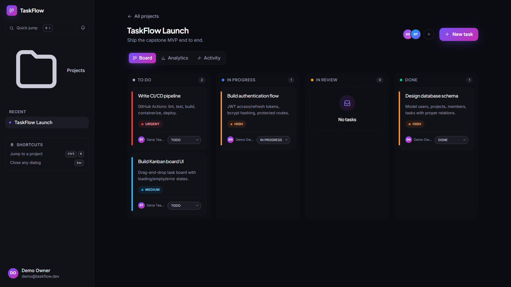
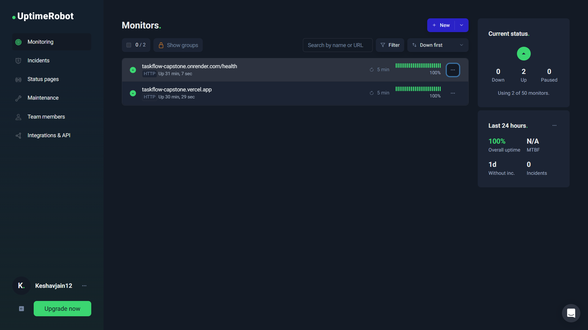
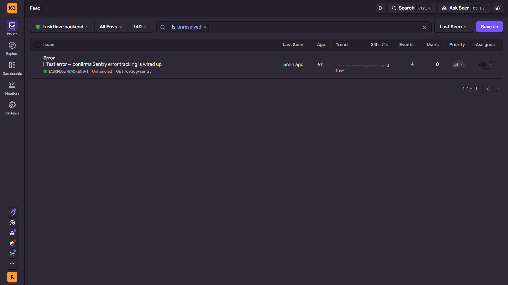
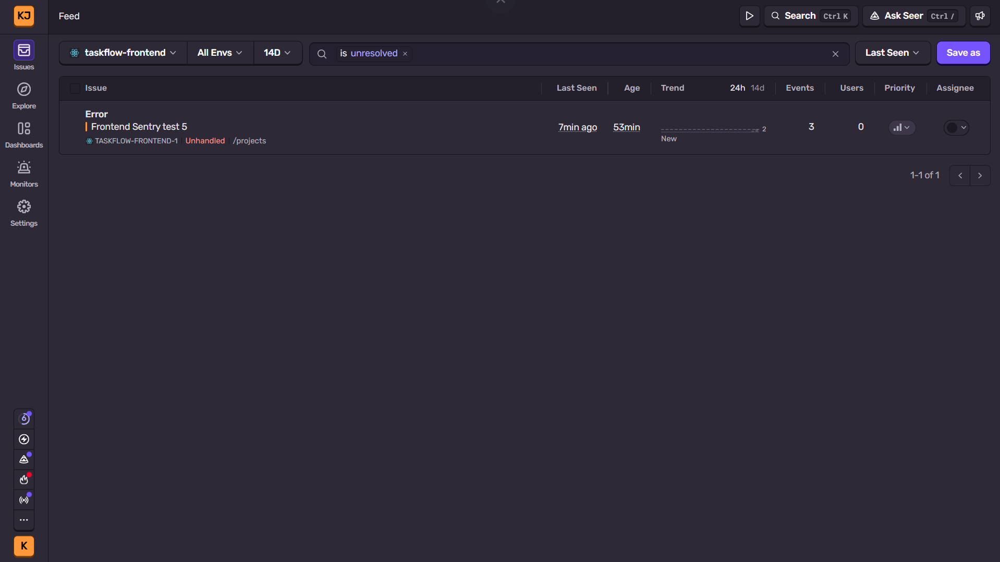

# TaskFlow — Full-Stack Task & Project Management Capstone

[](https://github.com/Keshavjain12/taskflow-capstone/actions/workflows/backend-ci.yml)
[](https://github.com/Keshavjain12/taskflow-capstone/actions/workflows/frontend-ci.yml)

**Live app:** https://taskflow-capstone.vercel.app · **API health check:** https://taskflow-capstone.onrender.com/health

> Backend runs on Render's free tier, which spins down after inactivity — the first request after a quiet
> period can take up to ~50s to wake it up. Reloading or waiting a moment resolves it.

TaskFlow is a production-style task/project management app: users register, create projects, invite
teammates by email, and organize work on a per-project Kanban board (To do → In progress → In review → Done)
with real pointer-based drag-and-drop. Beyond the core rubric it also includes a command palette (Cmd/Ctrl+K),
a dashboard with live stats/recent-activity/upcoming-work widgets, a notifications bell, a per-project
analytics tab and activity feed, and threaded task comments.

It is built end-to-end per the capstone handbook: a typed Node.js/Express API, a React/TypeScript frontend,
PostgreSQL via Prisma, JWT auth with refresh tokens, automated tests at three levels, Docker/Compose,
GitHub Actions CI/CD with auto-deploy, Swagger API docs, and Sentry error tracking + UptimeRobot uptime
monitoring on both deployed services.

> **Demo login (after seeding):** `demo@taskflow.dev` / `Password123!` — or just register your own account.

## Table of contents

- [Screenshots](#screenshots)
- [Architecture](#architecture)
- [Tech stack](#tech-stack)
- [Project structure](#project-structure)
- [Local setup](#local-setup)
- [API reference](#api-reference)
- [Testing](#testing)
- [Docker & Docker Compose](#docker--docker-compose)
- [CI/CD pipeline](#cicd-pipeline)
- [Deployment](#deployment)
- [Monitoring & logging](#monitoring--logging)
- [Environment variables](#environment-variables)
- [Known limitations & future work](#known-limitations--future-work)

## Screenshots

| Login | Dashboard | Kanban board |
| --- | --- | --- |
|  |  |  |

**Monitoring in action:**

| UptimeRobot (both services up) | Sentry — backend error captured | Sentry — frontend error captured |
| --- | --- | --- |
|  |  |  |

## Architecture

Classic 3-tier architecture. Frontend and backend are independently built, containerized, and deployed;
the frontend talks to the API exclusively over HTTPS/JSON using a build-time-configured base URL.

```
┌──────────────────┐      HTTPS/JSON      ┌───────────────────────┐      TCP       ┌──────────────────┐
│   React SPA       │ ───────────────────▶ │  Node.js / Express     │ ─────────────▶ │   PostgreSQL       │
│   (Vite, nginx)    │ ◀─────────────────── │  REST API (/api/v1)    │ ◀───────────── │   (Prisma ORM)     │
└──────────────────┘                       └───────────────────────┘                └──────────────────┘
                                                        │
                                                        ▼
                                            ┌───────────────────────┐
                                            │   GitHub Actions CI     │
                                            │   lint → typecheck →    │
                                            │   test → build → push → │
                                            │   deploy                │
                                            └───────────────────────┘
```

**Backend layering:** `routes → controllers → services → Prisma` — controllers stay thin (parse request,
call service, shape response), services own business logic and authorization, and a centralized error
handler converts any thrown `AppError` (or Prisma error) into a consistent JSON error shape.

**Data model:** `User` 1—N `Project` (as owner), `Project` N—N `User` through `ProjectMember` (role-scoped:
`OWNER` | `MEMBER`), `Project` 1—N `Task`, `Task` N—1 `User` (assignee, nullable) and N—1 `User` (creator).
See [`backend/prisma/schema.prisma`](backend/prisma/schema.prisma).

## Tech stack

| Layer          | Technology                                                             |
| -------------- | ----------------------------------------------------------------------- |
| Frontend       | React 18, Vite, TypeScript, TanStack Query, Zustand, Tailwind CSS, React Hook Form |
| Backend        | Node.js 20, Express, TypeScript, Zod validation, Pino logging            |
| Database       | PostgreSQL 16, Prisma ORM (migrations + typed client)                   |
| Auth           | JWT access (15m) + refresh (7d) tokens, bcryptjs password hashing        |
| Testing        | Jest + Supertest (backend unit/integration), Vitest + Testing Library (frontend unit), Playwright (E2E) |
| Containers     | Docker (multi-stage builds), Docker Compose                              |
| CI/CD          | GitHub Actions (lint → typecheck → test → build → push → deploy)         |
| API docs       | swagger-jsdoc + swagger-ui-express at `/api-docs`                        |
| Monitoring     | Sentry (error tracking), UptimeRobot (uptime), Pino (structured logs)    |

## Project structure

```
capstone-project/
├── .github/workflows/       # backend-ci.yml, frontend-ci.yml
├── backend/
│   ├── src/
│   │   ├── config/          # env, db (Prisma client), logger, sentry
│   │   ├── controllers/     # thin HTTP handlers
│   │   ├── middlewares/     # auth, validate, errorHandler, rateLimiter
│   │   ├── models/          # Zod request schemas
│   │   ├── routes/          # versioned Express routers (+ OpenAPI JSDoc)
│   │   ├── services/        # business logic + authorization
│   │   ├── utils/           # AppError, jwt, pagination, asyncHandler
│   │   ├── docs/            # swagger.ts
│   │   ├── instrument.ts    # Sentry init entry point (imported first)
│   │   ├── app.ts / server.ts
│   ├── prisma/               # schema.prisma, migrations/, seed.ts
│   ├── tests/{unit,integration}
│   ├── start.sh              # migrate -> seed (best-effort) -> start
│   └── Dockerfile
├── frontend/
│   ├── src/{pages,components,hooks,api,store,lib}
│   ├── tests/e2e/            # Playwright specs
│   └── Dockerfile
├── docker-compose.yml
└── docs/                     # ARCHITECTURE.md, DEPLOYMENT.md, screenshots/
```

## Local setup

**Prerequisites:** Docker + Docker Compose (recommended), or Node.js 20+ and a local PostgreSQL 16 instance.

### Option A — Docker Compose (matches production, zero manual setup)

```bash
git clone https://github.com/Keshavjain12/taskflow-capstone.git
cd taskflow-capstone
docker compose up --build
```

This single command builds and starts Postgres, runs migrations, seeds demo data, starts the API, and
serves the built frontend via nginx.

- Frontend: http://localhost:3000
- Backend health check: http://localhost:4000/health
- API docs (Swagger UI): http://localhost:4000/api-docs

### Option B — Run services natively

```bash
# 1. Database
docker run -d --name capstone-db -e POSTGRES_USER=capstone -e POSTGRES_PASSWORD=capstone \
  -e POSTGRES_DB=capstone_db -p 5432:5432 postgres:16-alpine

# 2. Backend
cd backend
cp .env.example .env        # edit if needed
npm install
npm run prisma:migrate:deploy
npm run prisma:seed
npm run dev                 # http://localhost:4000

# 3. Frontend (new terminal)
cd frontend
cp .env.example .env
npm install
npm run dev                 # http://localhost:3000
```

## API reference

Full interactive docs (request/response schemas, try-it-out) are served at **`/api-docs`** once the backend
is running, generated from JSDoc annotations in `backend/src/routes/*.ts` (`swagger-jsdoc` +
`swagger-ui-express`). Summary of endpoints:

| Method | Endpoint                                    | Auth | Description                          |
| ------ | -------------------------------------------- | ---- | ------------------------------------- |
| POST   | `/api/v1/auth/register`                      | –    | Create an account, returns tokens     |
| POST   | `/api/v1/auth/login`                         | –    | Log in, returns tokens                |
| POST   | `/api/v1/auth/refresh`                       | –    | Exchange refresh token for new access token |
| POST   | `/api/v1/auth/logout`                        | ✓    | Revoke refresh token                  |
| GET    | `/api/v1/auth/me`                            | ✓    | Current user profile                  |
| GET    | `/api/v1/projects`                           | ✓    | List projects (paginate/search/sort)  |
| POST   | `/api/v1/projects`                           | ✓    | Create a project                      |
| GET    | `/api/v1/projects/:id`                       | ✓    | Project detail                        |
| PATCH  | `/api/v1/projects/:id`                       | ✓    | Update project (owner only)           |
| DELETE | `/api/v1/projects/:id`                       | ✓    | Delete project (owner only)           |
| POST   | `/api/v1/projects/:id/members`               | ✓    | Add member by email (owner only)      |
| GET    | `/api/v1/projects/:projectId/tasks`          | ✓    | List tasks (paginate/filter/search/sort) |
| POST   | `/api/v1/projects/:projectId/tasks`          | ✓    | Create a task                         |
| GET    | `/api/v1/projects/:projectId/tasks/:id`      | ✓    | Task detail                           |
| PATCH  | `/api/v1/projects/:projectId/tasks/:id`      | ✓    | Update task (status, priority, ...)   |
| DELETE | `/api/v1/projects/:projectId/tasks/:id`      | ✓    | Delete task                           |
| GET    | `/health`                                    | –    | Liveness/health probe                 |
| GET    | `/debug-sentry`                              | –    | Throws a test error to verify Sentry wiring |

All list endpoints accept `page`, `limit`, `search`, and resource-specific filters (`status`, `priority`,
`assigneeId`) plus `sortBy`/`sortOrder`, and return a `meta` block (`page`, `limit`, `total`, `totalPages`,
`hasNextPage`, `hasPrevPage`).

## Testing

| Level       | Location                          | Command (from `backend/` or `frontend/`) |
| ----------- | ---------------------------------- | ------------------------------------------ |
| Backend unit | `backend/tests/unit`              | `npm run test:unit`                        |
| Backend integration | `backend/tests/integration` | `npm run test:integration` (needs a running Postgres — see `DATABASE_URL`) |
| Backend coverage | —                              | `npm run test:coverage` (coverage report in `backend/coverage/`) |
| Frontend unit | `frontend/src/**/__tests__`      | `npm run test`                              |
| E2E (Playwright) | `frontend/tests/e2e`         | `npm run test:e2e` (needs the app running, see `playwright.config.ts`) |

CI runs all of the above automatically on every push/PR to `main` (see [CI/CD pipeline](#cicd-pipeline)).

## Docker & Docker Compose

- `backend/Dockerfile` — multi-stage (`builder` → `runner`), non-root user, `HEALTHCHECK` against `/health`,
  `start.sh` as the boot command (migrate → seed best-effort → start).
- `frontend/Dockerfile` — multi-stage, static build served by nginx with SPA fallback routing.
- `docker-compose.yml` — brings up Postgres, backend (migrate → seed → start), and frontend with proper
  `depends_on`/health-based ordering. Run with `docker compose up --build`.

## CI/CD pipeline

Two independent GitHub Actions workflows (path-scoped, so a frontend-only change doesn't re-run backend CI):

- **`.github/workflows/backend-ci.yml`** — install → lint → typecheck → `prisma generate` → `prisma migrate
  deploy` against an ephemeral Postgres service container → unit + integration tests with coverage → build →
  (on `main`) Docker build & push → deploy webhook.
- **`.github/workflows/frontend-ci.yml`** — install → lint → typecheck → unit tests → build → Playwright E2E
  against the built app → (on `main`) Docker build & push → deploy webhook.

Required repo secrets: `DOCKERHUB_USERNAME`, `DOCKERHUB_TOKEN`, `RENDER_DEPLOY_HOOK`, `VERCEL_DEPLOY_HOOK`.
Set these under **Settings → Secrets and variables → Actions** in your GitHub repo — never commit them.
All four are configured on this repo, so every push to `main` that passes CI automatically redeploys both
services — no manual deploy step required.

## Deployment

| Component | Host                                     | Live URL |
| --------- | ----------------------------------------- | -------- |
| Frontend  | Vercel (static build, auto-deploy from `main`) | https://taskflow-capstone.vercel.app |
| Backend   | Render (Docker-native, auto-deploy from `main`) | https://taskflow-capstone.onrender.com |
| Database  | Neon (managed serverless Postgres)        | — |

## Monitoring & logging

- Structured JSON logs via **Pino** (`pino-http` request logging, redacts `Authorization`/passwords/tokens).
- `/health` endpoint for container healthchecks and external uptime monitors.
- **UptimeRobot** polls both the frontend and the backend `/health` endpoint every 5 minutes and emails on
  downtime.
- **Sentry** is wired into both apps and opt-in via env var (`SENTRY_DSN` backend, `VITE_SENTRY_DSN`
  frontend) — see `backend/src/config/sentry.ts` and `frontend/src/main.tsx`. Uncaught exceptions on either
  service are captured with a full stack trace, breadcrumbs, and request/browser context. Neither app
  requires Sentry to be configured to run: both simply skip initialization if the DSN env var is unset.

## Environment variables

See `backend/.env.example` and `frontend/.env.example` for the full list. Highlights:

| Variable | Where | Purpose |
| -------- | ----- | ------- |
| `DATABASE_URL` | backend | Postgres connection string |
| `JWT_ACCESS_SECRET` / `JWT_REFRESH_SECRET` | backend | Sign/verify JWTs — must be long, random, and different from each other |
| `CLIENT_ORIGIN` | backend | Locks CORS to the deployed frontend origin |
| `SENTRY_DSN` | backend (optional) | Enables backend error tracking if set |
| `VITE_API_URL` | frontend (build-time) | Base URL the SPA calls |
| `VITE_SENTRY_DSN` | frontend (build-time, optional) | Enables frontend error tracking if set |

## Known limitations & future work

- **Real-time updates:** the board currently refetches via TanStack Query invalidation rather than
  WebSocket/SSE push; a `Socket.IO` layer would make multi-user boards feel instant.
- **Refresh-token revocation list:** logout invalidates the stored hash for that user, but there's no
  per-device session list yet (only one active refresh token per user at a time).
- **bcryptjs instead of native bcrypt:** the handbook suggests `bcrypt`; this project uses `bcryptjs` (a
  pure-JS, API-compatible implementation) to avoid native build tooling (`node-gyp`) in constrained/offline
  build environments and slimmer Docker images. Hashing behavior and security properties are equivalent.
- **CSV export:** not yet implemented — a natural next enhancement.
- **Free-tier cold starts:** the Render backend spins down after ~15 minutes of inactivity (free tier), so
  the first request after a quiet period is slow (~50s) while it wakes up; subsequent requests are fast.
  Upgrading to a paid Render instance removes this entirely.

---

Built by Keshav Raj Jain.
